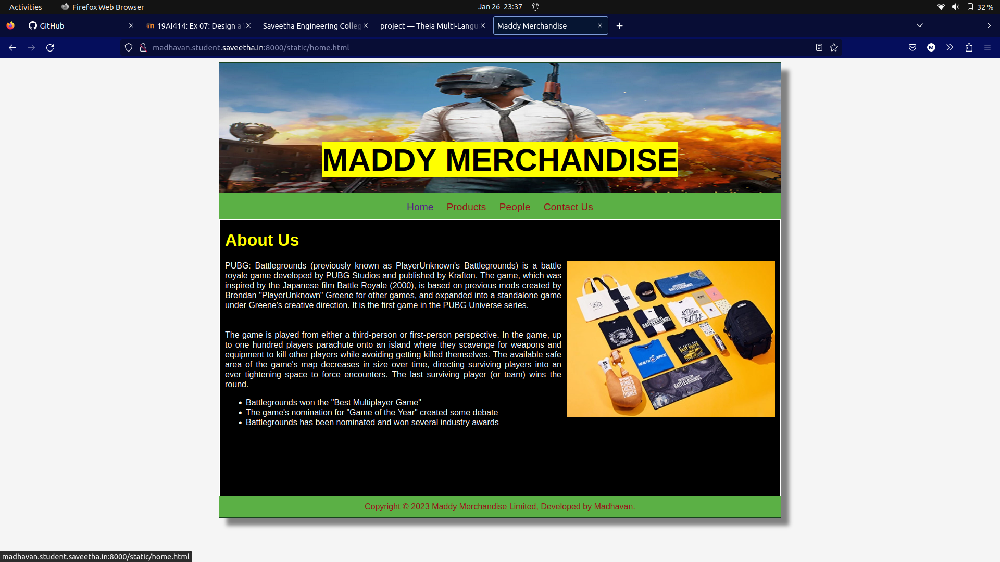
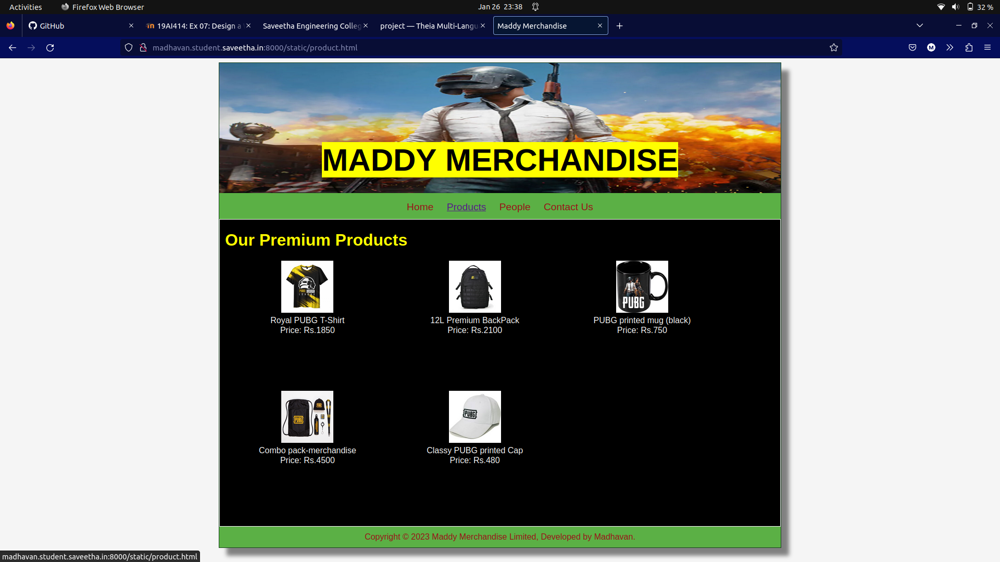
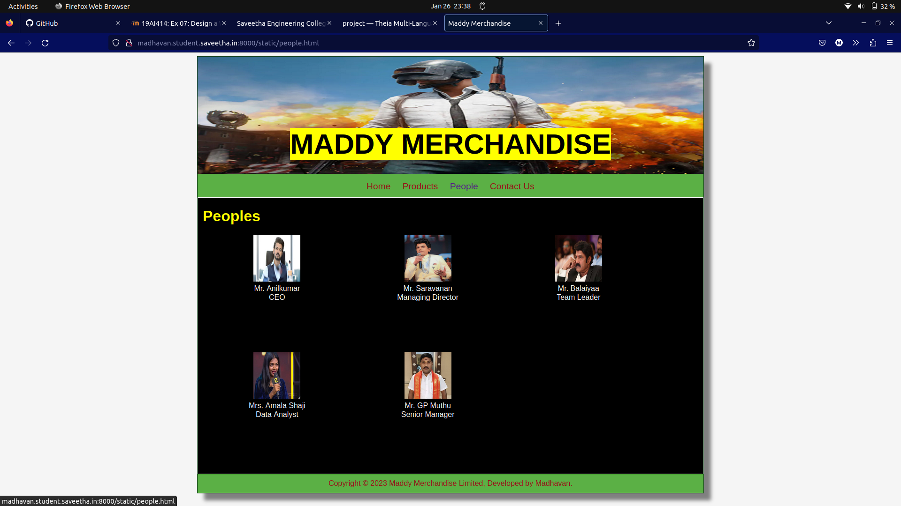

# Web Design for a Software Product Company

## AIM:

To design a static website for a software product company company.

## DESIGN STEPS:

### Step 1:

Requirement collection.

### Step 2:

Creating the layout using HTML and CSS.

### Step 3:

Updating the sample content.

### Step 4:

Choose the appropriate style and color scheme.

### Step 5:

Validate the layout in various browsers.

### Step 6:

Validate the HTML code.

### Step 6:

Publish the website in the given URL.

## PROGRAM :
home.html:
```
<!DOCTYPE html>
<html lang="en">
  <head>
    <title>Maddy Merchandise</title>
    <link rel="icon" href="./img/icon.png" type="image/x-icon" />
    <link rel="stylesheet" href="layout.css">
  </head>

  <body>
    <div class="container">
      <div class="banner"><span style="background-color: #FFFF00">MADDY MERCHANDISE</span></div>
      <div class="menu">
        <div class="menuitemselected"><a href="home.html">Home</a></div>
        <div class="menuitem"><a href="product.html">Products</a></div>
        <div class="menuitem"><a href="people.html">People</a></div>
        <div class="menuitem"><a href="contact.html">Contact Us</a></div>
      </div>
      <div class="content">
        <div class="homecontent">
          <h1>About Us</h1>
          
          <div class="contenttext">
            PUBG: Battlegrounds (previously known as PlayerUnknown's Battlegrounds) is a battle royale game developed by PUBG Studios and published by Krafton. The game, which was inspired by the Japanese film Battle Royale (2000), is based on previous mods created by Brendan "PlayerUnknown" Greene for other games, and expanded into a standalone game under Greene's creative direction. It is the first game in the PUBG Universe series.<br><br>
The game is played from either a third-person or first-person perspective. In the game, up to one hundred players parachute onto an island where they scavenge for weapons and equipment to kill other players while avoiding getting killed themselves. The available safe area of the game's map decreases in size over time, directing surviving players into an ever tightening space to force encounters. The last surviving player (or team) wins the round.
            <ul>
              <li>Battlegrounds won the "Best Multiplayer Game" </li>
              <li>The game's nomination for "Game of the Year" created some debate</li>
              <li>Battlegrounds has been nominated and won several industry awards</li>
            </ul> </div></div></div>
      <div class="footer">
        Copyright &#169; 2023 Maddy Merchandise Limited, Developed by Madhavan.
      </div></div>  </body></html>
```
product.html:
```
<!DOCTYPE html>
<html lang="en">
  <head>
    <title>Maddy Merchandise</title>
    <link rel="stylesheet" href="layout.css" />
    <link rel="icon" href="./img/icon.png" type="image/x-icon" />
  </head>
  <body>
    <div class="container">
      <div class="banner"><span style="background-color: #FFFF00">MADDY MERCHANDISE</span></div>
      <div class="menu">
        <div class="menuitem"><a href="home.html">Home</a></div>
        <div class="menuitemselected">
          <a href="product.html">Products</a>
        </div>
        <div class="menuitem"><a href="people.html">People</a></div>
        <div class="menuitem"><a href="contact.html">Contact Us</a></div>
      </div>
      <div class="content"><div class="productcontent">    
          <h1>Our Premium Products</h1>
          <div class="productitems"><div class="productitem"> 
                  <div class="itemimage">
                  
                  </div>
                  <div class="itemname">Royal PUBG T-Shirt</div>
                  <div class="itemprice">Price: Rs.1850 </div> </div><div class="productitem"> 
                  <div class="itemimage">
                  </div><div class="itemname">12L Premium BackPack</div>
                  <div class="itemprice">Price: Rs.2100 </div>
              </div>
              <div class="productitem"> 
                <div class="itemimage">
                
                </div>
                <div class="itemname">PUBG printed mug (black)</div>
                <div class="itemprice">Price: Rs.750 </div>
            </div>
            <div class="productitem"> 
              <div class="itemimage">
              
              </div>
              <div class="itemname">Combo pack-merchandise</div>
              <div class="itemprice">Price: Rs.4500 </div>
          </div>
          <div class="productitem"> 
            <div class="itemimage">
            
            </div>
            <div class="itemname">Classy PUBG printed Cap</div>
            <div class="itemprice">Price: Rs.480 </div>
        </div>      </div>          </div>       </div>
      <div class="footer">
        Copyright &#169; 2023 Maddy Merchandise Limited, Developed by Madhavan.
      </div>    </div>  </body> </html>
```
people.html:
```
<!DOCTYPE html>
<html lang="en">
  <head>
    <title>Maddy Merchandise</title>
    <link rel="stylesheet" href="layout.css" />
    <link rel="icon" href="./img/icon.png" type="image/x-icon" />
  </head>
  <body>
    <div class="container">
      <div class="banner"><span style="background-color: #FFFF00">MADDY MERCHANDISE</span></div>
      <div class="menu">
        <div class="menuitem"><a href="home.html">Home</a></div>
        <div class="menuitem">
          <a href="product.html">Products</a>
        </div>
        <div class="menuitemselected"><a href="people.html">People</a></div>
        <div class="menuitem"><a href="contact.html">Contact Us</a></div>
      </div>
      <div class="content">
        <div class="productcontent">    
          <h1>Peoples</h1>
          <div class="productitems">
              <div class="productitem"> 
                  <div class="itemimage">
                  
                  </div>
                  <div class="itemname">Mr. Anilkumar</div>
                  <div class="itemprice">CEO</div>
              </div>
              <div class="productitem"> 
                  <div class="itemimage">
                  
                  </div>
                  <div class="itemname">Mr. Saravanan</div>
                  <div class="itemprice">Managing Director</div>
              </div>
              <div class="productitem"> 
                <div class="itemimage">
                
                </div>
                <div class="itemname">Mr. Balaiyaa</div>
                <div class="itemprice">Team Leader</div>
            </div>
            <div class="productitem"> 
              <div class="itemimage">
              
              </div>
              <div class="itemname">Mrs. Amala Shaji</div>
              <div class="itemprice">Data Analyst</div>
          </div>
          <div class="productitem"> 
            <div class="itemimage">
            
            </div>
            <div class="itemname">Mr. GP Muthu</div>
            <div class="itemprice">Senior Manager</div>
        </div>
          </div>
          </div>        
      </div>
      <div class="footer">
        Copyright &#169; 2023 Maddy Merchandise Limited, Developed by Madhavan.
      </div>    </div>  </body></html>
```
contact.html:
```
<!DOCTYPE html>
<html lang="en">
  <head>
    <title>Maddy Merchandise</title>
     <link rel="stylesheet" href="layout.css">
  </head>
  <body>
    <div class="container">
      <div class="banner"><span style="background-color: #FFFF00">MADDY MERCHANDISE</span></div>
      <div class="menu">
        <div class="menuitem"><a href="home.html">Home</a></div>
        <div class="menuitem"><a href="product.html">Products</a></div>
        <div class="menuitem"><a href="people.html">People</a></div>
        <div class="menuitemselected"><a href="contact.html">Contact Us</a></div>
      </div>
      <hr>
      <div class="content">
        <div class="homecontent">
          <h1>Contact Us</h1>
          <h1>Address:</h1>
          <div class="contenttext">
            Maddy Merchandise Private Limited ,
            <br>69, Vivekanadhar Street,
            <br>Chennai-600 028
          </div><br>
          <h1>Phone:</h1><br>
          <div class="contenttext">
              Mr.gows(MARKETING MANAGER):8220156869<br><br>
              Mr.bhaskar(OPERATION MANAGER):9865432145<br><br>
              Mr.gopathi(OFFICE MANAGER):6384569585
          </div>
          <h1>E-Mail:</h1>
          <div class="contenttext">
              Sales: maddymerchantlimited@gmail.com
          </div>
        </div>
      </div>
      <div class="footer">
        Copyright &#169; 2023 Maddy Merchandise Limited, Developed by Madhavan.
      </div>    </div>  </body> </html>
```

## OUTPUT:

### Home Page:

### Product Page:

### People Page:

### Contact Page:


## Result:

Thus a website is designed for the software product company and the HTML,CSS code are validated.
